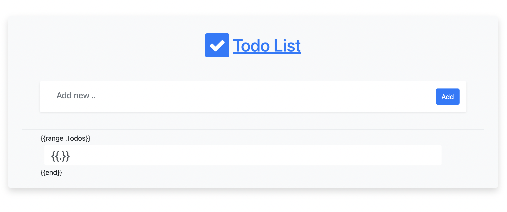

<p align="center">
    
</p>

<h1 align="center">
Planner
</h1>

Task management with Golang and PostgresQL. A best practice for working with PostgresQL in Golang applications.

## How to run the project?
Make sure you have **docker** and **golang** installed on your system.

Clone the project:
```shell
git clone https://github.com/amirhnajafiz/planner.git
```

Use docker to start the PostgresQL server on your system:
```shell
make dk-up
```

### Note
If you want to shut down the server, use:
```shell
make dk-down
```

Now run the following command to create your database in PostgresQL server:
```shell
make db-set
```

After that migrate your database schema:
```shell
make mig-up
```

Now start the application:
```shell
make start
```

Application is now running on _localhost:8080_
